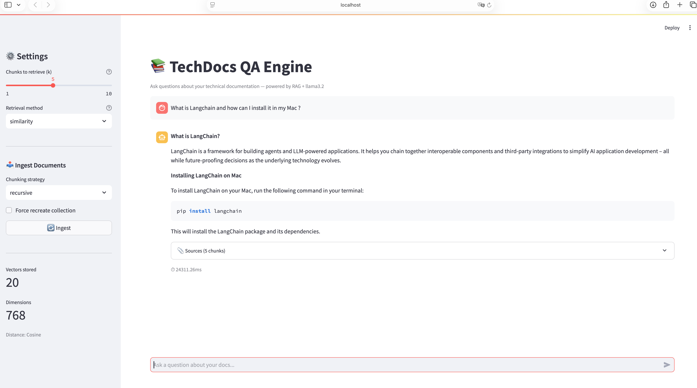

# 📚 TechDocs QA Engine

> Ask questions about your technical documentation and get grounded, cited answers — powered by RAG, LangChain, Qdrant, and llama3.2 running 100% locally on Apple Silicon.


---

## What is this?

I built this because I was tired of Ctrl+F-ing through 200-page documentation PDFs.

TechDocs QA Engine is a **production-style RAG pipeline** that ingests your technical docs, indexes them into a vector database, and lets you ask plain English questions — returning grounded answers with citations back to the source chunks. No hallucinations. No guessing. Just answers backed by your actual documentation.

The entire stack runs locally. No OpenAI API calls. No data leaving your machine. Zero cost per query.

---

## Demo



> *Ask a question → retrieve relevant chunks → generate a grounded answer with source citations*

---

## Architecture


---

## Stack

| Layer | Technology | Why |
|---|---|---|
| Orchestration | LangChain 0.3 + LCEL | Industry standard, clean pipe syntax, async-ready |
| Vector DB | Qdrant | Fast ANN search, rich metadata filtering, Docker-friendly |
| Embeddings | nomic-embed-text (Ollama) | 768-dim, runs on Apple Silicon unified memory |
| Generation | llama3.2 (Ollama) | Local inference, no API cost, swappable via LCEL |
| API | FastAPI | Auto Swagger docs, Pydantic validation, async |
| UI | Streamlit | Rapid chat interface with session state |
| Evaluation | RAGAS (manual) | Faithfulness, relevancy, precision, recall |

---

## Benchmark Results

Evaluated on 5 questions against the LangChain README using recursive chunking (k=3):

| Metric | Score | What it means |
|---|---|---|
| **Faithfulness** | **0.94** | Answers stay grounded in retrieved context |
| **Answer Relevancy** | **0.84** | Answers actually address what was asked |
| **Context Precision** | **0.78** | Retrieved chunks are relevant to the question |
| **Context Recall** | **0.76** | Retrieved chunks cover what's needed to answer |

The most interesting result: for questions about LangGraph (not covered in our test document), the model correctly responded *"I don't have enough information"* rather than hallucinating an answer. That's the system prompt doing its job.

---

## Chunking Strategy Comparison

Benchmarked on `langchain_readme.txt` (6865 chars):

| Strategy | Chunks | Avg Size | Notes |
|---|---|---|---|
| Fixed | 18 | 383 chars | Fast, ignores sentence boundaries |
| **Recursive** | **20** | **344 chars** | **Default — respects natural language structure** |
| Semantic | 20 | 344 chars | Better on long-form narrative content |

Recursive is the default. Swap it at ingest time from the UI sidebar.

---

## Getting Started

### Prerequisites

- Python 3.13+
- [Docker Desktop](https://www.docker.com/products/docker-desktop/)
- [Ollama](https://ollama.com/) with Apple Silicon support

### 1. Clone and set up environment

```bash
git clone https://github.com/pranayhedau007/techdocs-qa-engine.git
cd techdocs-qa-engine
python -m venv venv
source venv/bin/activate
pip install -r requirements.txt
```

### 2. Pull models

```bash
ollama pull llama3.2          # generation model (2.0 GB)
ollama pull nomic-embed-text  # embedding model (274 MB)
```

### 3. Start Qdrant

```bash
docker run -d -p 6333:6333 -p 6334:6334 \
  -v $(pwd)/qdrant_storage:/qdrant/storage \
  --name qdrant \
  qdrant/qdrant
```

### 4. Add your documents

Drop your PDFs or `.txt` files into `data/docs/`. Any format, any size.

### 5. Start the backend

```bash
python -m uvicorn api.main:app --reload --port 8000
```

### 6. Start the UI

```bash
streamlit run ui/app.py
```

Open `http://localhost:8501`, click **Ingest** in the sidebar, then start asking questions.

---

## API Reference

The FastAPI backend auto-generates Swagger docs at `http://localhost:8000/docs`.

### `POST /ask`

```json
{
  "question": "How do I install LangChain?",
  "k": 5,
  "method": "similarity"
}
```

Response includes the answer, source chunks with content and metadata, retrieval method used, and end-to-end latency in ms.

### `POST /ingest`

```json
{
  "strategy": "recursive",
  "chunk_size": 500,
  "chunk_overlap": 50,
  "force_recreate": false
}
```

### `GET /health` · `GET /stats`

Health probe and collection diagnostics respectively.

---

## Project Structure

```
techdocs-qa-engine/
├── src/
│   ├── ingestion/
│   │   ├── loader.py        # PDF + TXT document loading
│   │   ├── chunker.py       # 3 chunking strategies + benchmarks
│   │   └── embedder.py      # nomic-embed-text via Ollama
│   ├── retrieval/
│   │   ├── vector_store.py  # Qdrant collection management
│   │   └── retriever.py     # Similarity + MMR search
│   ├── generation/
│   │   ├── llm.py           # ChatOllama wrapper
│   │   └── chain.py         # LCEL RAG chain
│   └── evaluation/
│       └── ragas_eval.py    # RAGAS evaluation pipeline
├── api/
│   └── main.py              # FastAPI endpoints
├── ui/
│   └── app.py               # Streamlit chat interface
├── data/
│   └── docs/                # Drop your documents here
└── requirements.txt
```

---

## What I'd improve next

A few things I'd tackle to take this to production:

- **Document cleaning** — strip HTML/Markdown tags before chunking. The LangChain README has a lot of HTML that ends up in chunks and hurts retrieval precision.
- **Hybrid search** — combine vector similarity with BM25 keyword search. Better for technical terms like function names that embeddings sometimes miss.
- **Streaming responses** — LCEL already supports `.stream()`, just needs to be wired into the FastAPI and Streamlit layers for token-by-token display.
- **Multi-collection support** — one collection per documentation source (LangChain, FastAPI, Qdrant) with routing logic.
- **Automated RAGAS CI** — run evaluation on every new document batch to catch retrieval regressions.

---

## Performance Notes

All benchmarks on Apple Silicon M-series with unified memory:

- **Embedding speed**: 20 chunks in 2.62s (nomic-embed-text)
- **Query latency**: <1s retrieval, 12-15s generation (local llama3.2)
- **Ingestion**: ~15s for 20 chunks end-to-end

In production with a hosted model (Claude, GPT-4o), generation drops to under 2 seconds.

---

## Author

**Pranay Hedau** — MS Computer Science @ UC Irvine

Building at the intersection of backend systems and applied AI. If you found this useful or have questions about the implementation, reach out on [LinkedIn](https://www.linkedin.com/in/pranay-hedau/) or check out my [YouTube channel](https://youtu.be/Jlu9al3lzH8) where I break down projects like this one.

---

*If this helped you, drop a ⭐ — it genuinely helps with discoverability.*
